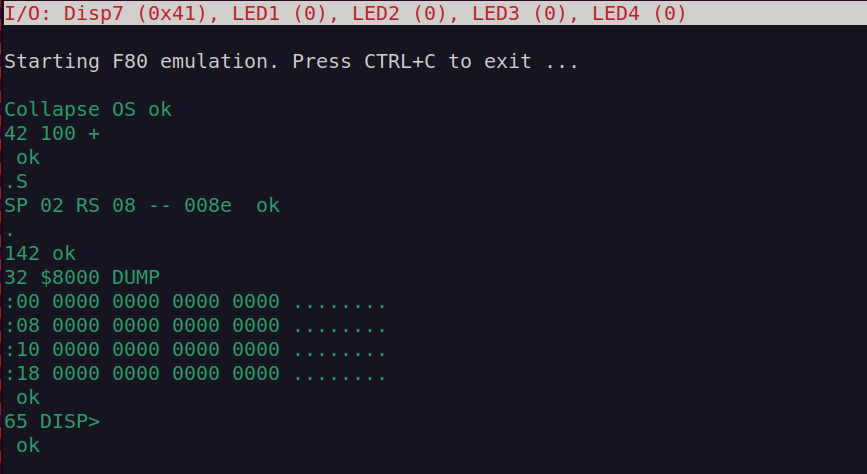

# Collapse OS

To use [Collapse OS](http://collapseos.org/) on f80 it must first be downloaded an prepeared. Collapse OS is provided as tar archive. The script `get.sh` is provided to automate the process:

```shell
$ cd src/collapse-os
$ ./get.sh
```

This downloads the latest version and its docuentation.
The distribution is extracted into the `os`
subdirectory. Next, the f80 Collapse OS port from
directory `src/collapse-os/f80` is copied into the
Collapse OS source tree.

Now building could be done with:

```shell
$ cd os/arch/z80/f80
$ ./build.sh
```

If all goes well, there should be an `os.bin` file. This
is the Z80 binary of Collapse OS for the f80. It can be
tried using the [f80 emulator](../emulator/readme.md) or
included in the FPGA bitstream by modifying `src/gateware/top.py`
(search for `cpu_ram_init_file` and replace with path to
`os.bin`).



A few forth words for controlling f80 peripherals are
included:

|Command|Stack|Description|
|---|---|---|
| .S | ( -- ) | Displays current stack |
| DUMP | ( l a -- ) | Dumps out `l` bytes starting from address `a` |
| DISP> | ( v -- ) | Sends 8bit value `v` to seven-segment display |
| LEDS> | ( v -- ) | Sends lower 4bits from value `v` to LEDs (where bit0 is LED1, bit1 LED2 etc.)
| BUTTONS@ | ( -- b ) | Reads buttons 0 to 3 into lower 4bits of `b` |
| SWITCHES@ | ( -- s ) | Reads switches 0 to 3 into lower 4bits of `b` |
| CLK_SYS@ | ( -- c ) | Reads current system ticker into 8bit value `c`. System ticker increments with system clock speed |
| CLK_MS@ | ( -- c ) | Reads current millisecond ticker into 8bit value `c`. Millisecond ticker increments on every millisecond |
| RGBn-ON | ( -- ) | Turns on RGB LED n (1 - 4) to bright white |
| RGBn-OFF | ( -- ) | Turns off RGB LED n (1 - 4) |
| RGBn> | ( r g b -- ) | Sets red, green and blue values of RGB LED n (1 - 4). Each color value is 8bits |
