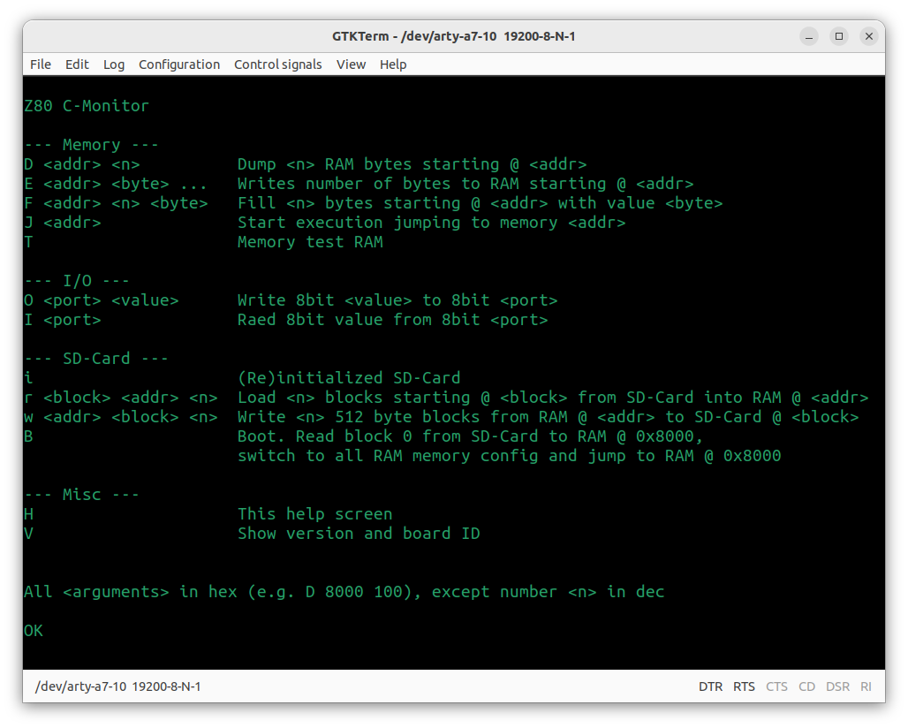

# f80 - Z80 Monitor program

f80 provides a simple monitor program built into the FPGA bitstream. It allows actions like dumping and loading memory and starting programs at given addresses.

The monitor is accessible using a serial terminal program on the host with settings 115200 baud, 8 data bits, no parity and 1 stop bit (115200 8 N 1).

To monitor versions are available: one written in pure assembler and one written in C. The later providing more functions like SD-Card access or a better memory dump.

When f80 is powered up, the following output should be shown on the serial console ...

for the assembler monitor:

for the C monitor:

Enter **H** to show some help. The upload function is very simple and uses direct, raw binary data. The utility `tools/upload.py` is used to simplify this.

